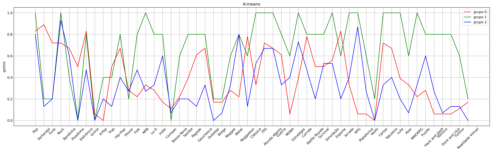
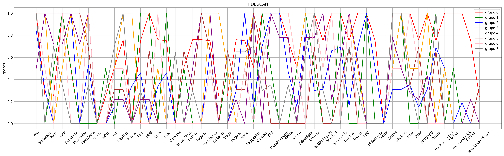

### Dependencies
````commandline 
python -m pip install --upgrade pip
pip install pandas
pip install scikit-learn
pip install matplotlib
pip install numpy
```` 
# Saidas

Primeiro realizei um expperimento para ver o quando o pop era popular no agrupamento:


## Usei o modelo de agglomerative clusturing para ver se qual os gostos da maioria por uma outra dinamica, pois com esse algoritimo e possivel limitar a distancia e ver quantos grupos se formariam, assim vendo o quando de similariedade tem os gostos.

## Plotei o grafico com o k-means e chegeui no seguinte resultado:



### Não é muito complexo, por ter poucos grupos e apenas fazendo médias não é dificil descobrir os padrões, porem não é muito acertivo
### Por exemplo as quantidades foram:
| GRUPO | QUANTIDADE |
|-------|------------|
| 0     | 18         |
| 1     | 5          |
| 2     | 15         |

* percebe-se que quem ficou no grupo 1 tem uma maior flexibilidade, ou seja não tem muita preferêcia.
* O grupo 0 gosta de sertanejo, pagode, gaucheca, raggeton e isso implica em gostos em jogos de esporte, estratégia, cartas, corrida e FPS.
* O grupo 1 gosta apenas não gosta de setanejo, funk, pisadinha, grime, compas, brega, dubstemp. Isso reflete nos gostos de jogos. Por se tratar de médias acabamostrando gostar de quase todos os gêneros.
* o grupo 2 é menos flexivel do que o grupo 1 mas tem gostos pareciso com os outros grupos, desta-se o gosto por metal e RPG.

## Após descobri ques dos três métodos para descobrir similiaridades o mais adequado foi o HDBSCAN, com ele plotei o grafico com os dados.



| GRUPO | QUANTIDADE |
|-------|------------|
| 0     | 4          |
| 1     | 2          |
| 2     | 6          |
| 3     | 2          |
| 4     | 4          |
| 5     | 3          |
| 6     | 2          |
| 7     | 3          |
| -1    | 12         |

* A dispersão está muito maior e mais precisa.
* O grupo 4 gosta de sertanejo, funk, rock, bandinha, pisadinha, eletronica, pagode, gauchesca e rsggaeton implica que gosta de cartas, esporte, battle royale, corrida, estratégia, guerra, mundo aberto e FPS.

## As maiores vantagens do HDBSCAN e do agglomerative clusturing foi deixar o próprio algoritimo escolher quantos clusters irś criar, ainda assim o HDBSCAN permite usar uma especie de mediana descartando gostos muito específicos


### Links 
#### https://scikit-learn.org/stable/modules/clustering.html


https://neptune.ai/blog/k-means-clustering#:~:text=K%2Dmeans%2B%2B%20is%20a,as%20possible%20from%20one%20another.

