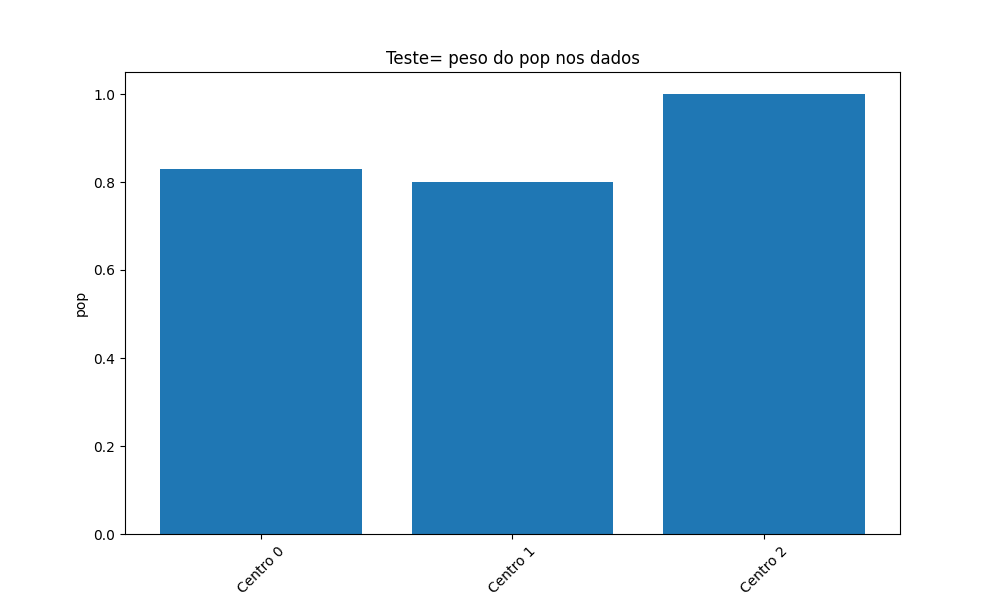

### Dependencies
````commandline 
python -m pip install --upgrade pip
pip install pandas
pip install scikit-learn
pip install matplotlib
```` 
#### https://scikit-learn.org/stable/modules/clustering.html


# Saidas




https://neptune.ai/blog/k-means-clustering#:~:text=K%2Dmeans%2B%2B%20is%20a,as%20possible%20from%20one%20another.